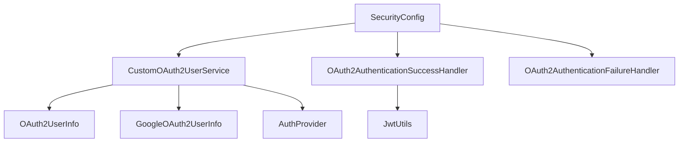

# Google OAuth2 Login Module - Danh Sách File Mới

Tài liệu này liệt kê **TẤT CẢ** các file mới đã được thêm vào để implement chức năng đăng nhập Google OAuth2.

---

## 📊 Tổng Quan

| Phần | Số File Mới | Tổng Dung Lượng |
|------|-------------|-----------------|
| **Backend** | 7 files | ~15 KB |
| **Frontend** | 2 files | ~5 KB |
| **TỔNG CỘNG** | **9 files** | **~20 KB** |

---

## 🔷 BACKEND - 7 Files Mới

### 1. Domain Layer (1 file)

#### 📄 `AuthProvider.java`
**Đường dẫn**: `BackEnd/src/main/java/com/nftmarketplace/backend/domain/AuthProvider.java`

**Mục đích**: Enum định nghĩa các loại authentication provider

**Nội dung**:
```java
package com.nftmarketplace.backend.domain;

public enum AuthProvider {
    LOCAL,
    GOOGLE
}
```

**Kích thước**: ~150 bytes

---

### 2. Security - OAuth2 Package (5 files)

#### 📄 `OAuth2UserInfo.java`
**Đường dẫn**: `BackEnd/src/main/java/com/nftmarketplace/backend/security/oauth2/OAuth2UserInfo.java`

**Mục đích**: Abstract class để extract thông tin user từ OAuth2 providers

**Chức năng**:
- `getId()` - Lấy user ID từ provider
- `getName()` - Lấy tên user
- `getEmail()` - Lấy email
- `getImageUrl()` - Lấy avatar URL

**Kích thước**: ~600 bytes

---

#### 📄 `GoogleOAuth2UserInfo.java`
**Đường dẫn**: `BackEnd/src/main/java/com/nftmarketplace/backend/security/oauth2/GoogleOAuth2UserInfo.java`

**Mục đích**: Implementation cụ thể cho Google OAuth2 user info

**Mapping Google attributes**:
- `sub` → User ID
- `name` → Username
- `email` → Email
- `picture` → Avatar URL

**Kích thước**: ~700 bytes

---

#### 📄 `CustomOAuth2UserService.java`
**Đường dẫn**: `BackEnd/src/main/java/com/nftmarketplace/backend/security/oauth2/CustomOAuth2UserService.java`

**Mục đích**: Service xử lý OAuth2 authentication flow

**Chức năng chính**:
- Load user từ Google OAuth2
- Tạo user mới nếu chưa tồn tại
- Update thông tin user nếu đã tồn tại
- Gán role mặc định `ROLE_USER`
- Validate email từ Google

**Dependencies**:
- `UserRepository`
- `RoleRepository`

**Kích thước**: ~3 KB

---

#### 📄 `OAuth2AuthenticationSuccessHandler.java`
**Đường dẫn**: `BackEnd/src/main/java/com/nftmarketplace/backend/security/oauth2/OAuth2AuthenticationSuccessHandler.java`

**Mục đích**: Handler xử lý khi OAuth2 login thành công

**Chức năng**:
- Generate JWT token
- Redirect về frontend với token trong URL query param
- Target URL: `http://localhost:5173/oauth2/redirect?token={jwt}`

**Dependencies**:
- `JwtUtils`

**Kích thước**: ~1.5 KB

---

#### 📄 `OAuth2AuthenticationFailureHandler.java`
**Đường dẫn**: `BackEnd/src/main/java/com/nftmarketplace/backend/security/oauth2/OAuth2AuthenticationFailureHandler.java`

**Mục đích**: Handler xử lý khi OAuth2 login thất bại

**Chức năng**:
- Redirect về login page với error message
- Target URL: `http://localhost:5173/login?error={message}`

**Kích thước**: ~800 bytes

---

### 3. Database Migration (1 file)

#### 📄 `V1__Add_OAuth2_Fields_To_Users.sql`
**Đường dẫn**: `BackEnd/src/main/resources/db/migration/V1__Add_OAuth2_Fields_To_Users.sql`

**Mục đích**: Migration thêm OAuth2 fields vào bảng users

**SQL Script**:
```sql
-- Add OAuth2 provider fields to users table
ALTER TABLE users
ADD COLUMN provider VARCHAR(20) DEFAULT 'LOCAL',
ADD COLUMN provider_id VARCHAR(255);

-- Update existing users to have LOCAL provider
UPDATE users SET provider = 'LOCAL' WHERE provider IS NULL;

-- Add index for faster OAuth2 lookups
CREATE INDEX idx_users_provider_provider_id ON users(provider, provider_id);
```

**Thay đổi schema**:
- Thêm cột `provider` (VARCHAR, default 'LOCAL')
- Thêm cột `provider_id` (VARCHAR, nullable)
- Thêm index cho performance

**Kích thước**: ~400 bytes

---

## 🔶 FRONTEND - 2 Files Mới

### 1. Components (2 files)

#### 📄 `GoogleLoginButton.tsx`
**Đường dẫn**: `Frontend/MarketPlaceNFT_Frontend/src/components/GoogleLoginButton.tsx`

**Mục đích**: Component button đăng nhập Google

**Chức năng**:
- Hiển thị button với logo Google
- Redirect đến backend OAuth2 endpoint: `http://localhost:8085/oauth2/authorization/google`
- Sử dụng `GoogleOAuthProvider` từ `@react-oauth/google`

**Props**:
- `onSuccess?: () => void` (optional)
- `onError?: (error: string) => void` (optional)

**Dependencies**:
- `@react-oauth/google`
- `react-router-dom`
- `react-hot-toast`

**Kích thước**: ~1.5 KB

---

#### 📄 `OAuth2RedirectHandler.tsx`
**Đường dẫn**: `Frontend/MarketPlaceNFT_Frontend/src/components/OAuth2RedirectHandler.tsx`

**Mục đích**: Component xử lý OAuth2 callback từ backend

**Chức năng**:
- Parse token từ URL query param
- Lưu token vào `localStorage`
- Decode JWT để lấy user info
- Lưu user info vào `localStorage`
- Redirect về trang chủ hoặc login (nếu lỗi)
- Hiển thị loading spinner

**URL Pattern**: `/oauth2/redirect?token={jwt}` hoặc `/oauth2/redirect?error={message}`

**Dependencies**:
- `react-router-dom`
- `react-hot-toast`

**Kích thước**: ~2 KB

---

## 📋 Cấu Trúc Thư Mục Đầy Đủ

```
FinalProject-main/
│
├── BackEnd/
│   └── src/main/
│       ├── java/com/nftmarketplace/backend/
│       │   ├── domain/
│       │   │   └── AuthProvider.java                    ✨ MỚI
│       │   │
│       │   └── security/oauth2/                         ✨ FOLDER MỚI
│       │       ├── OAuth2UserInfo.java                  ✨ MỚI
│       │       ├── GoogleOAuth2UserInfo.java            ✨ MỚI
│       │       ├── CustomOAuth2UserService.java         ✨ MỚI
│       │       ├── OAuth2AuthenticationSuccessHandler.java  ✨ MỚI
│       │       └── OAuth2AuthenticationFailureHandler.java  ✨ MỚI
│       │
│       └── resources/db/migration/
│           └── V1__Add_OAuth2_Fields_To_Users.sql       ✨ MỚI
│
└── Frontend/
    └── MarketPlaceNFT_Frontend/src/components/
        ├── GoogleLoginButton.tsx                        ✨ MỚI
        └── OAuth2RedirectHandler.tsx                    ✨ MỚI
```

---

## 🔗 Dependencies Giữa Các File

### Backend Dependencies



### Frontend Dependencies

```mermaid
graph TD
    A[GoogleLoginButton] --> B[@react-oauth/google]
    C[OAuth2RedirectHandler] --> D[react-router-dom]
    E[login/index.tsx] --> A
    F[router.tsx] --> C
```

---

## 📦 Package Cho Khách Hàng

### Cách 1: Copy Từng File

**Backend** - Copy 7 files:
1. `AuthProvider.java` → `domain/`
2. `OAuth2UserInfo.java` → `security/oauth2/`
3. `GoogleOAuth2UserInfo.java` → `security/oauth2/`
4. `CustomOAuth2UserService.java` → `security/oauth2/`
5. `OAuth2AuthenticationSuccessHandler.java` → `security/oauth2/`
6. `OAuth2AuthenticationFailureHandler.java` → `security/oauth2/`
7. `V1__Add_OAuth2_Fields_To_Users.sql` → `resources/db/migration/`

**Frontend** - Copy 2 files:
1. `GoogleLoginButton.tsx` → `src/components/`
2. `OAuth2RedirectHandler.tsx` → `src/components/`

### Cách 2: Zip Archive

Tạo file `google-oauth2-module.zip` chứa:
```
google-oauth2-module/
├── backend/
│   ├── domain/
│   ├── security/oauth2/
│   └── db/migration/
└── frontend/
    └── components/
```

---

## ⚙️ Yêu Cầu Bổ Sung

Ngoài 9 files mới, khách cần:

### Backend
1. **pom.xml** - Thêm dependency:
   ```xml
   <dependency>
       <groupId>org.springframework.boot</groupId>
       <artifactId>spring-boot-starter-oauth2-client</artifactId>
   </dependency>
   ```

2. **application.properties** - Thêm config:
   ```properties
   spring.security.oauth2.client.registration.google.client-id=...
   spring.security.oauth2.client.registration.google.client-secret=...
   ```

3. **User.java** - Thêm 2 fields:
   ```java
   @Enumerated(EnumType.STRING)
   private AuthProvider provider;
   private String providerId;
   ```

4. **UserDetailsImpl.java** - Implement `OAuth2User`

5. **SecurityConfig.java** - Enable OAuth2 login

### Frontend
1. **package.json** - Thêm dependency:
   ```json
   "@react-oauth/google": "^0.12.1"
   ```

2. **login/index.tsx** - Import và sử dụng `GoogleLoginButton`

3. **router.tsx** - Thêm route `/oauth2/redirect`

---

## 📝 Ghi Chú

- ✅ Tất cả files đều **độc lập**, không phụ thuộc lẫn nhau
- ✅ Có thể copy riêng lẻ từng file
- ✅ Không xóa/sửa code cũ
- ⚠️ Cần config Google OAuth2 credentials
- ⚠️ Cần chỉnh sửa 7 files có sẵn (xem phần "Yêu Cầu Bổ Sung")

---

**Ngày tạo**: 2025-11-26  
**Version**: 1.0  
**Tác giả**: Anh Khoa
